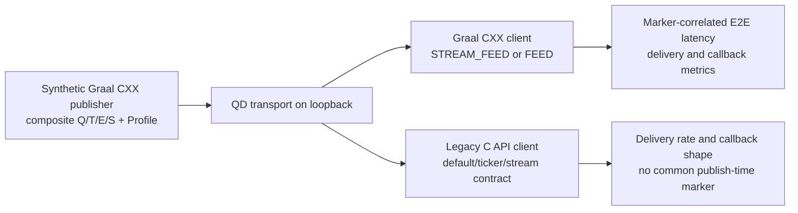

# dxFeed Graal C++ latency test

This project is a two-process load-testing tool. The server publishes configurable batches of synthetic `Quote`,
`Trade`, `TradeETH`, and `Summary` events and can publish an initial `Profile` state. The client measures the time
between the server's `publishEvents` call and delivery to the C++ event listener. A third executable converts QD
monitoring logs into machine-readable CSV files and compares repeated runs.

## Native build

The build requires CMake 3.21 or newer, a C++23 compiler, and network access for the pinned dxFeed Graal C++ API and
Graal Native SDK archives.

`LATENCY_DXFCXX_RELEASE` selects a supported release stack. It defaults to `v7.0.0`; `v5.0.0` is also pinned for
controlled release comparisons. Use a separate build directory for every release because FetchContent selections
are cached. The compiler, selected CXX API, its Native SDK, and QD dependency versions are recorded in each
benchmark `environment.txt`.

On Linux or macOS, use a single-configuration build:

```sh
cmake -S . -B build -DCMAKE_BUILD_TYPE=Release \
  -DDXFCXX_BUILD_DOC=OFF -DDXFCXX_BUILD_SAMPLES=OFF -DDXFCXX_BUILD_TOOLS=OFF
cmake --build build --parallel
ctest --test-dir build --output-on-failure
```

For example, configure the older comparison stack with:

```sh
cmake -S . -B build-v5 -DCMAKE_BUILD_TYPE=Release -DLATENCY_DXFCXX_RELEASE=v5.0.0
```

On Windows, run the following from a Visual Studio developer shell:

```powershell
cmake -S . -B build -A x64 `
  -DDXFCXX_BUILD_DOC=OFF -DDXFCXX_BUILD_SAMPLES=OFF -DDXFCXX_BUILD_TOOLS=OFF
cmake --build build --config Release --parallel
ctest --test-dir build -C Release --output-on-failure
```

Quote the release definition when passing it from PowerShell:

```powershell
cmake -S . -B build-v5 -A x64 '-DLATENCY_DXFCXX_RELEASE=v5.0.0'
```

The executables are under `build/` with a single-configuration generator and under `build/Release/` with Visual
Studio. Run any executable with `--help` to see all options.

### Runtime properties and code style

The default [`dxfeed.system.properties`](dxfeed.system.properties) file is loaded by the dxFeed Graal C++ API when
the isolate is initialized. It enables `dxscheme.nanoTime=true` for all dxFeed entities in the process. Docker
images set `DXFEED_dxfeed.system.properties` to the installed copy explicitly; for a native run, keep the file in
the process working directory or set the same environment variable to a different properties file. Options that
are expected to vary per run, such as `monitoring.stat`, are still applied programmatically before the first
endpoint is created and therefore also have process-wide scope.

First-party code targets C++23. clang-format 20.1.8 is the primary formatter; Uncrustify 0.83.0 adds the
statement-level blank-line rules from [`CONTRIBUTING.md`](CONTRIBUTING.md) that clang-format cannot express. After
configuring the project, equivalent cross-platform formatting commands are available as CMake targets:

```sh
cmake --build build --target format
cmake --build build --target check-format
```

In CLion, enable clang-format for the project and run the `format` target when statement-level spacing also needs to
be applied. Both tools must match the versions above so local output remains identical to CI.

Tests use the header-only doctest framework, fetched at its pinned release by CMake.

## Executables

`latency_server` is a QD publisher. It listens on `--address` (default `:7400`) and waits for a client to subscribe to
a task string. It supports one active task at a time and waits until the publisher observes the complete requested
symbol set for every market event type before publishing the initial Profiles and starting the recurring load. It
creates stable synthetic event objects for that task and publishes combined event/marker batches at the configured
cadence until the subscription is removed. The marker timestamp is captured immediately before `publishEvents()`;
server logs separately report preparation time,
publisher call time, achieved rate, and missed publication deadlines. `--monitoring-stat` controls the QD statistics
period and accepts `0` to disable it. For portable sub-20-ms scheduling, the generator yields during the final 20 ms
before a deadline; high-frequency profiles can therefore consume one CPU core on the publisher. `--task` queues a
task directly and is intended for clients, such as the legacy C API, that cannot use the `TextMessage` control
channel. The queued task still waits for all required subscriptions before it starts.

`latency_client` requests the task, discards the warm-up interval, and records latency during the measurement
interval. Its main options are:

| Option | Default | Purpose |
|---|---:|---|
| `--address` | `127.0.0.1:7400` | Server endpoint. |
| `--task` | `SUB:Q100` | Synthetic event quantities, cadence, and optional subscribed universe. |
| `--warmup` | `30s` | Data collection period excluded from reports. |
| `--duration` | `5m` | Reported measurement period. |
| `--window` | `10s` | Size of each summary row's time window. |
| `--batch-timeout` | `30s` | Maximum wait for an incomplete marker/event batch. |
| `--startup-timeout` | `30s` | Maximum wait for all unique initial Profile symbols before warm-up. |
| `--listener-delay` | `0` | Artificial delay at the start of each market-event callback. |
| `--events-batch-limit` | `optimal` | Maximum market events per native notification: `optimal`, `maximum`, or a positive integer. |
| `--aggregation-period` | `0` | Per-subscription market notification aggregation period; `0` disables explicit aggregation. |
| `--monitoring-stat` | `10s` | QD statistics period; `0` disables it. |
| `--role` | `stream-feed` | Endpoint role: `stream-feed` preserves updates; `feed` permits conflation. |
| `--output` | `latency` | Path and filename prefix for generated CSV files. |

The task DSL is `SUB:<type><quantity>[;...][@<period>][#<symbols>][&<regional-sources>][~<shuffle-seed>]`: `Q`, `T`, `E`, and `S` mean
Quote, Trade, TradeETH, and Summary. Each type may occur once and quantities must be positive. All configured types
are recurring and contribute to the nominal event rate. The default period is `1s`. The optional final symbol count
expands the subscribed instrument universe without changing the number of events published in each batch. It cannot
be smaller than any configured event quantity. An optional regional-source count from 1 through 26 activates `&A`,
`&B`, ... record keys in addition to the composite keys without changing the event count per publication. A final
shuffle seed enables reproducible per-publication shuffling of the configured event-type blocks and regional-source
selection.

For example, `SUB:Q375;T375;E375;S375@10ms` publishes 1,500 recurring events every 10 ms (150,000 events/s).
The common instrument universe contains 375 symbols named `SYM000` through `SYM374`; the numeric width is derived
once from the largest configured quantity. A type with a smaller quantity uses a prefix of the same universe. The
client automatically includes `Profile` in its single combined market-event subscription. The test server waits for
that subscription and every requested recurring event subscription to contain the complete common universe, then
publishes one initial Profile for every symbol. The client starts its warm-up only after all unique Profile symbols
have arrived, so subscription propagation is excluded from the configured warm-up duration.

For example, `SUB:Q375;T375;E375;S375@10ms#3750` still publishes 1,500 events every 10 ms, but subscribes to
`SYM0000` through `SYM3749` and publishes 3,750 initial Profiles. Every recurring publication advances each event
type by 375 symbols through this universe. This keeps throughput constant while varying subscription cardinality.

`SUB:Q375;T375;E375;S375@10ms#375&26~22805` also remains at 1,500 events per publication and 150,000 events/s.
It creates 10,125 market record keys per type (`375 × (composite + 26 regional sources)`) and deterministically
distributes each publication across them. Profiles remain one per base instrument, so this task still publishes 375
initial Profiles. The Graal client explicitly subscribes to those composite and regional symbols; the default legacy
C API client adds only the 375 base symbols because that API performs its own regional expansion.

`latency_analyzer` is a standalone post-processing utility and does not connect to dxFeed. It reads a directory of
latency summaries and captured QD logs, then writes `monitoring.csv` and `monitoring-summary.csv`. Pass
`--run-directory` and the same `--monitoring-period` that was used by server and client. Durations accepted by all
tools use `ms`, `s`, `m`, or `h` suffixes.

### Legacy C API delivery client

Set `LATENCY_BUILD_LEGACY_CLIENT=ON` to build the separate `latency_legacy_client` executable. CMake downloads the
official pinned dxFeed C API 5.11.0 no-TLS binary SDK and exposes it through an imported target; it does not embed the
upstream source project or manually copy its source lists. This optional target is supported only on 64-bit Windows
and Linux. It is kept in a separate process so the legacy native library and the Graal Native SDK are never loaded
into the same address space.

The legacy client deliberately measures connectivity and delivery shape. It subscribes to the task's
`Quote`, `Trade`, `TradeETH`, and `Summary` types plus `Profile`, then reports callback count, recurring event count,
initial Profile count, the largest legacy `data_count`, and measurement-interval CPU/RSS from
[`ttldtor/Process`](https://github.com/ttldtor/Process). It does not report E2E latency: `Trade` and `Quote` expose
`time_nanos`, while `Summary` and `Profile` do not expose an equivalent event timestamp, and none of those fields is
the benchmark server's `publishEvents()` timestamp.

Configure and build it on Windows with:

```powershell
cmake -S . -B build-legacy -A x64 '-DLATENCY_BUILD_LEGACY_CLIENT=ON'
cmake --build build-legacy --config Release --parallel
```

Then run the server and client in separate terminals with the same task:

```powershell
.\build-legacy\Release\latency_server.exe --address :7400 --task "SUB:Q10;T10;E10;S10@100ms"
.\build-legacy\Release\latency_legacy_client.exe --address 127.0.0.1:7400 `
    --task "SUB:Q10;T10;E10;S10@100ms" --duration 10s --contract default --require-events
```

Use `--contract ticker` or `--contract stream` to force the corresponding legacy subscription flag. The default
uses the C API's normal per-record contract selection, which is the relevant baseline for reproducing existing
legacy-client behavior. Pass `--trace-subscriptions` to `latency_server` to log the symbol cardinality it observes.
With the default C API contract, a smoke run using one base symbol produced 27 server-side subscriptions for each
recurring type: the composite symbol plus `&A` through `&Z`. `Profile` produced only the composite subscription.
Consequently, `SUB:Q1;T1;E1;S1` represents 109 observed server-side keys even though it publishes four recurring
composite events per period.

The two client paths remain isolated and intentionally measure different observables:



`latency_runner` can select the client per profile using the optional sixth field:
`PROFILE=name|task|client-role|events-batch-limit|aggregation-period|client-implementation`. The implementation is
`graal` by default, preserving existing suite files; use `legacy` only in builds configured with
`LATENCY_BUILD_LEGACY_CLIENT=ON`. Legacy runs write `<prefix>-delivery.csv`, and the analyzer produces separate
`delivery-runs.csv` and `delivery-comparison.csv` files instead of presenting delivery counters as latency.

The ready-to-run `tools/legacy-api-comparison.conf` suite rotates three repetitions of the Graal CXX `STREAM_FEED`
and default legacy C API clients at the same shuffled 150,000 composite events/s workload. It compares observable
delivery and callback shape. It does not claim that a callback-rate difference proves a transport regression or
that the two APIs expose equivalent latency timestamps.

`tools/regional-fanout.conf` compares zero, one, four, and twenty-six active regional sources for both clients while
holding the aggregate recurring rate at 150,000 events/s. This separates record-key routing and subscription fan-out
from a simple increase in network throughput.

Run it from the same legacy-enabled build with:

```powershell
.\build-legacy\Release\latency_runner.exe --binary-directory .\build-legacy\Release `
    --config .\tools\legacy-api-comparison.conf
```

## Running a benchmark

Start the server:

```sh
./build/latency_server --address :7400
```

Then start the client in another terminal:

```sh
./build/latency_client --address 127.0.0.1:7400 --task "SUB:Q1000;T1000;E1000;S1000"
```

Append `.exe` and use `build/Release/` for a Visual Studio build. By default, the client performs a 30-second warm-up
followed by a five-minute measurement divided into 10-second windows. It writes `<prefix>-summary.csv`,
`<prefix>-callbacks.csv`, and `<prefix>-outliers.csv`; use `--output <prefix>` to choose their location and basename.
The callback report contains per-window and whole-run distributions for the number of events in each market-event
notification and the time spent in its user callback.

Both processes default `monitoring.stat` to `10s`, making QD print internal endpoint statistics every 10 seconds.
Pass `--monitoring-stat 0` to disable the reports or provide another positive duration. Redirect stdout and stderr
when the logs will be analyzed later:

```sh
./build/latency_server --address :7400 > run/q1k-server.log 2>&1
./build/latency_client --address 127.0.0.1:7400 --task "SUB:Q1000;S1000;T1000" \
  --output run/q1k > run/q1k-client.log 2>&1
./build/latency_analyzer --run-directory run --monitoring-period 10s
```

PowerShell uses the same executable and options. `latency_analyzer` looks for matching `<profile>-summary.csv` or
`<profile>-delivery.csv`, `<profile>-server.log`, and `<profile>-client.log` files. It writes every parsed interval to
`monitoring.csv` and profile/process aggregates for intervals wholly inside the measurement phase to
`monitoring-summary.csv`. QD log timestamps have no UTC offset and are interpreted in the analyzer process's local
time zone; analyze moved logs with the same `TZ` setting as the machine that produced them.

## Repeated local benchmark suite

The repository includes native launchers for a longer cadence comparison suite. They run three repetitions of four
mixed profiles in `FEED` mode, all nominally producing 150,000 recurring events/s: 150,000 events every second,
15,000 every 100 ms, 1,500 every 10 ms, and 150 every 1 ms. Each profile also sends one initial `Profile` per
instrument. The 1 ms profile is a scheduler/publisher stress case and should be interpreted separately. Every run
uses a one-minute warm-up, a ten-minute measurement, ten-second windows, and a fresh server/client pair. Profile
order rotates between repetitions and a 30-second cool-down separates runs.

Build the Release binaries first, then run the cross-platform `latency_runner` executable. On Windows:

```powershell
.\build\Release\latency_runner.exe --binary-directory .\build\Release `
    --config .\tools\benchmark-suite.conf
```

On Linux or macOS:

```sh
./build/latency_runner --binary-directory ./build \
    --config ./tools/benchmark-suite.conf
```

Use `--dry-run` to validate the suite and display all planned commands without starting a benchmark. Pass
`--config tools/benchmark-suite.conf` to select the suite, including its independent `STARTUP_TIMEOUT`. Results are
written below `benchmark-results/<UTC timestamp>/`. A full default run takes approximately two hours and twenty
minutes plus any machine-dependent startup overhead.

A `PROFILE` line may override the endpoint role, events batch limit, aggregation period, and client implementation
for that profile using
`PROFILE=name|task|client-role|events-batch-limit|aggregation-period|client-implementation`. Omitted fields inherit
`CLIENT_ROLE`, `EVENTS_BATCH_LIMIT`, and `AGGREGATION_PERIOD` from the suite; the last two default to `optimal` and
`0`, while the client implementation defaults to `graal`. Command-line `--events-batch-limit` and
`--aggregation-period` provide suite-wide overrides for profiles that do not specify them.

A suite may describe its experiment with `EXPERIMENT_TITLE`, `EXPERIMENT_OBJECTIVE`, `EXPERIMENT_VARIABLE`,
`EXPERIMENT_CONTROLS`, `EXPERIMENT_SUCCESS_CRITERIA`, and `EXPERIMENT_LIMITATIONS`. These settings are optional for
backward compatibility, but when one is present all six are required and must be non-empty. The analyzer reads them
from the preserved `suite.conf` and writes an `Experiment definition` section near the top of `REPORT.md`. Success
criteria describe which measurements should be evaluated; they do not turn the report into an automatic pass/fail
decision.

For a short contract A/B, run `tools/conflation-diagnostic.conf` once with the default `feed` role and once with a
`stream-feed` override. The task, symbol set, cadence, warm-up, and measurement duration remain identical:

```powershell
.\build\Release\latency_runner.exe --binary-directory .\build\Release `
    --config .\tools\conflation-diagnostic.conf --client-role feed
.\build\Release\latency_runner.exe --binary-directory .\build\Release `
    --config .\tools\conflation-diagnostic.conf --client-role stream-feed
```

```sh
./build/latency_runner --binary-directory ./build \
    --config ./tools/conflation-diagnostic.conf --client-role feed
./build/latency_runner --binary-directory ./build \
    --config ./tools/conflation-diagnostic.conf --client-role stream-feed
```

To test whether client-side listener speed contributes to FEED supersession, repeat the FEED diagnostic with a
controlled delay before every market-event callback. `0` disables the delay:

```powershell
.\build\Release\latency_runner.exe --binary-directory .\build\Release `
    --config .\tools\conflation-diagnostic.conf --client-role feed --listener-delay 1ms
```

```sh
./build/latency_runner --binary-directory ./build \
    --config ./tools/conflation-diagnostic.conf --client-role feed --listener-delay 1ms
```

`tools/symbol-cardinality.conf` compares 375, 3,750, and 10,000 subscribed symbols while keeping the recurring
workload at 150,000 events/s:

```powershell
.\build\Release\latency_runner.exe --binary-directory .\build\Release `
    --config .\tools\symbol-cardinality.conf
```

```sh
./build/latency_runner --binary-directory ./build \
    --config ./tools/symbol-cardinality.conf
```

`tools/event-order.conf` keeps the 375-symbol, 150,000-events/s workload fixed and places a different event type at
the end of each publication. The server preserves the event-type order written in the task DSL. This isolates an
event-class effect from a serialization-position effect:

```powershell
.\build\Release\latency_runner.exe --binary-directory .\build\Release `
    --config .\tools\event-order.conf
```

```sh
./build/latency_runner --binary-directory ./build \
    --config ./tools/event-order.conf
```

After the fixed-order comparison, `tools/event-order-shuffle.conf` uses seed `22805` to reshuffle the four event-type
blocks for every publication. The operation shuffles four indices, not all 1,500 events, so its cost is negligible
and included in the reported server preparation time:

```powershell
.\build\Release\latency_runner.exe --binary-directory .\build\Release `
    --config .\tools\event-order-shuffle.conf
```

```sh
./build/latency_runner --binary-directory ./build \
    --config ./tools/event-order-shuffle.conf
```

`tools/events-batch-limit.conf` compares native notification limits while holding the shuffled 375-symbol workload
at 150,000 events/s. It includes `optimal`, `1`, `375`, `1500`, and `maximum` FEED profiles plus a STREAM_FEED
control. Limit `1` is intentionally a callback-overhead stress case:

```powershell
.\build\Release\latency_runner.exe --binary-directory .\build\Release `
    --config .\tools\events-batch-limit.conf
```

```sh
./build/latency_runner --binary-directory ./build \
    --config ./tools/events-batch-limit.conf
```

`tools/aggregation-period.conf` isolates the per-subscription aggregation setting with FEED profiles using `0`,
`1ms`, and `10ms`, plus a `STREAM_FEED` profile using `0` as a delivery-contract control. All profiles use the same
shuffled 375-symbol, 150,000-event/s workload. The aggregation setting is applied only to the combined recurring
market-event subscription before symbols are added. Initial `Profile` events use a separate subscription, and the
`TextMessage` control channel is also separate. The client records the effective value returned by the C++ API in
`aggregation_period_ms`; no Java system property is involved.

```powershell
.\build\Release\latency_runner.exe --binary-directory .\build\Release `
    --config .\tools\aggregation-period.conf
```

```sh
./build/latency_runner --binary-directory ./build \
    --config ./tools/aggregation-period.conf
```

After that A/B test, `tools/aggregation-stream-control.conf` repeats the `0`, `1ms`, and `10ms` aggregation periods
with `STREAM_FEED`. It checks whether non-zero aggregation changes only notification batching and latency while the
non-conflating delivery contract still preserves every recurring event. The suite performs three repetitions and
takes approximately 15 minutes:

```powershell
.\build\Release\latency_runner.exe --binary-directory .\build\Release `
    --config .\tools\aggregation-stream-control.conf
```

The benchmark passes `monitoring.stat` directly to `DXEndpoint::Builder`. This is required for `STREAM_FEED`, whose
endpoint configuration does not import Java system properties. Both client and server monitoring should therefore
be present in the generated report; an `n/a` value still means that no parseable sample was emitted and must not be
interpreted as zero.

```sh
./build/latency_runner --binary-directory ./build \
    --config ./tools/aggregation-stream-control.conf
```

`tools/sdk-feed-control.conf` is the short release-stack FEED control. Run it from separately configured v5 and v7
build directories to compare natural TICKER supersession with no artificial listener delay or notification
aggregation. It performs three repetitions per stack and takes approximately seven minutes for each invocation:

```powershell
.\build-v5\Release\latency_runner.exe --binary-directory .\build-v5\Release `
    --config .\tools\sdk-feed-control.conf
.\build-v7\Release\latency_runner.exe --binary-directory .\build-v7\Release `
    --config .\tools\sdk-feed-control.conf
```

```sh
./build-v5/latency_runner --binary-directory ./build-v5 \
    --config ./tools/sdk-feed-control.conf
./build-v7/latency_runner --binary-directory ./build-v7 \
    --config ./tools/sdk-feed-control.conf
```

Each output prefix includes its repetition, for example `150k-100ms-r02`. The analyzer additionally writes
`latency-runs.csv`, `latency-comparison.csv`, `monitoring-comparison.csv`, and a concise `REPORT.md`. Comparison CSVs
contain the minimum, median, and maximum of run-level values; original summaries and logs remain available for more
detailed analysis. A failed run is recorded in `run-manifest.csv`, its partial CSV files are preserved with a
`.partial.csv` suffix, and the remaining profiles still run.

The client retains exact latency values to calculate whole-run percentiles. Each cadence profile records up to 90
million event samples over ten minutes and can temporarily require several gigabytes of memory while final totals
are copied and sorted. Run the suite on an otherwise idle machine with sufficient RAM. The launchers are intended
for local native measurements; GitHub Actions only performs their dry-run validation because hosted-runner latency
is not treated as benchmark data.

## Docker

The Linux and Windows images each contain `latency_server`, `latency_client`, and `latency_analyzer`. There is no fixed
entrypoint: put the desired executable immediately after the image name. Compose is not required.

### Linux containers

Build for the current Linux engine and CPU architecture:

```sh
docker --context linux-engine build -t dxfcxx-latency:linux -f Dockerfile .
```

Build one architecture explicitly with buildx:

```sh
docker --context linux-engine buildx build --load --platform linux/amd64 \
  -t dxfcxx-latency:linux-amd64 -f Dockerfile .
docker --context linux-engine buildx build --load --platform linux/arm64 \
  -t dxfcxx-latency:linux-arm64 -f Dockerfile .
```

Use `linux/arm64` on an Apple Silicon Colima engine to build and run natively. A multi-platform manifest requires an
image registry; replace `--load` with `--push`, specify both platforms, and use a registry-qualified tag.

### Windows containers

The Windows image targets Windows Server Core LTSC 2025 and `amd64`. Its builder installs Visual Studio Build Tools,
so the first build is large and may take considerable time and disk space:

```powershell
docker --context win-engine build --memory 4g --isolation hyperv `
  -t dxfcxx-latency:windows -f Dockerfile.windows .
```

The Windows container version must be compatible with the Windows host. Use Hyper-V isolation when the host cannot
run the LTSC 2025 image with process isolation.

### Running two containers

Create a private network and a host directory for results. On Linux or macOS:

```sh
docker network create latency-test
mkdir -p benchmark-results/docker-run

docker run -d --rm --name latency-server --network latency-test \
  dxfcxx-latency:linux latency_server --address :7400 --monitoring-stat 10s

docker run --rm --network latency-test \
  --mount type=bind,source="$(pwd)/benchmark-results/docker-run",target=/work \
  dxfcxx-latency:linux latency_client --address latency-server:7400 \
  --task "SUB:Q1000;S1000;T1000" --output q1k --monitoring-stat 10s \
  > benchmark-results/docker-run/q1k-client.log 2>&1

docker logs latency-server > benchmark-results/docker-run/q1k-server.log 2>&1
docker stop latency-server
docker run --rm --mount type=bind,source="$(pwd)/benchmark-results/docker-run",target=/work \
  dxfcxx-latency:linux latency_analyzer --run-directory /work --monitoring-period 10s
```

For a Windows container, use Windows paths and executable names:

```powershell
$resultDir = (New-Item -ItemType Directory -Force benchmark-results\docker-run).FullName
docker --context win-engine network create --driver nat latency-test
docker --context win-engine run -d --rm --name latency-server --network latency-test `
  dxfcxx-latency:windows latency_server.exe --address :7400 --monitoring-stat 10s
docker --context win-engine run --rm --network latency-test `
  --mount "type=bind,source=$resultDir,target=C:\work" `
  dxfcxx-latency:windows latency_client.exe --address latency-server:7400 `
  --task "SUB:Q1000;S1000;T1000" --output q1k --monitoring-stat 10s `
  *> "$resultDir\q1k-client.log"
docker --context win-engine logs latency-server *> "$resultDir\q1k-server.log"
docker --context win-engine stop latency-server
docker --context win-engine run --rm --mount "type=bind,source=$resultDir,target=C:\work" `
  dxfcxx-latency:windows latency_analyzer.exe --run-directory C:\work --monitoring-period 10s
```

Use the selected Docker context on every command if it is not current. Container bridge networking, CPU quotas,
emulation, and bind mounts can affect latency. Record the image architecture, Docker context, network mode, and
resource limits with benchmark results; use native processes when measuring the lowest host-level latency.

## Timestamping and correlation

Both processes set `dxscheme.nanoTime=true` before creating their endpoints. The server fills the nano-time and
sequence fields of event types that support them. However, `eventTime` is not transmitted through the network QTP
connection, and `Quote` loses its sequence and fractional seconds with the tested scheme. An accompanying
`TextMessage` with the payload `LATENCY_BATCH:<unix_ns>` therefore carries the exact publish timestamp in the same
batch.

`Trade` events are correlated with the marker by sequence, `Summary` events by a synthetic `dayId`, and `Quote`
events by the seconds component of their exchange time. The last mapping is unambiguous at the fixed rate of one
batch per second. This is a synthetic wire contract used by the test; `Summary::dayId` does not represent a trading
date here.

The client defaults to `STREAM_FEED`, so conflation does not intentionally hide intermediate updates. The benchmark
suite selects `FEED` explicitly to reproduce normal feed semantics. Latency is stored in nanoseconds and displayed
in microseconds. A value above `Q3 + 1.5 * IQR` for the current window is classified as an outlier. The current QD
implementation explicitly changes the receiving agent's overflow strategy to `BLOCK` for `STREAM_FEED`. This
preserves intermediate updates by applying backpressure when its finite buffer fills. Other endpoint roles and QD
buffers can use different overflow behavior, so the benchmark still records `Dropped` on both processes.

The summary contains aggregate `event` and `batch` rows plus rows for each recurring event type. Their
`expected_per_batch` value is the expected sample count for that row (`1` for `batch`). The delivery-accounting
columns report published and listener-observed recurring events, `listener_coverage`, `listener_deficit`, excess
events, and full/partial/empty correlated publications. `listener_deficit` is deliberately named as an observation,
not a cause or a transport-loss counter. In `FEED` mode it may contain TICKER states superseded before listener
delivery; compare it with QD `Dropped`, buffer, lag, and publication diagnostics before attributing every deficit to
conflation. Events whose timestamp marker was not delivered are counted as
`uncorrelated_events`; they are excluded from the conditional listener coverage and cannot produce a latency sample.
Initial `Profile` delivery is reported separately in the client log and is excluded from recurring latency/rate
statistics. Event outliers are classified against the IQR threshold of their own event type and use the corresponding
type-specific sample kind in the outliers file.

The source-level distinction between normal `FEED` supersession and `STREAM_FEED` buffering is documented in
[`benchmark-results/QD-FEED-DELIVERY-PATH.md`](benchmark-results/QD-FEED-DELIVERY-PATH.md). A controlled comparison
of two CXX API, Native SDK, and QD release stacks is in
[`benchmark-results/SDK-VERSION-COMPARISON.md`](benchmark-results/SDK-VERSION-COMPARISON.md). The repeated delivery
comparison between the Graal CXX `STREAM_FEED` client and legacy C API default client is in
[`benchmark-results/20260906T145936Z/REPORT.md`](benchmark-results/20260906T145936Z/REPORT.md).

The legacy C API does not implement the newer client-side FEED conflation mechanism, delivers events to its callback
one at a time, and does not support `TextMessage`, which the Graal benchmark uses as the exact per-publication
timestamp marker. The implemented legacy comparison therefore reports delivery rate and callback shape, not E2E
latency. A direct latency comparison still requires a different marker carried by an event supported by both APIs;
that marker must be validated for identical serialization and decoding before comparing its results with the Graal
reports.

## QD monitoring statistics

Periodic `{latency-server}` and `{latency-client}` records include subscription, storage, outgoing-buffer,
dropped-record, I/O-rate, data-lag, round-trip-time, and process-CPU statistics when available. I/O rates describe
the interval since the previous report. CPU is normalized to the total capacity of all logical processors, so one
fully occupied logical processor on a 32-processor machine is approximately `3.125%`.
