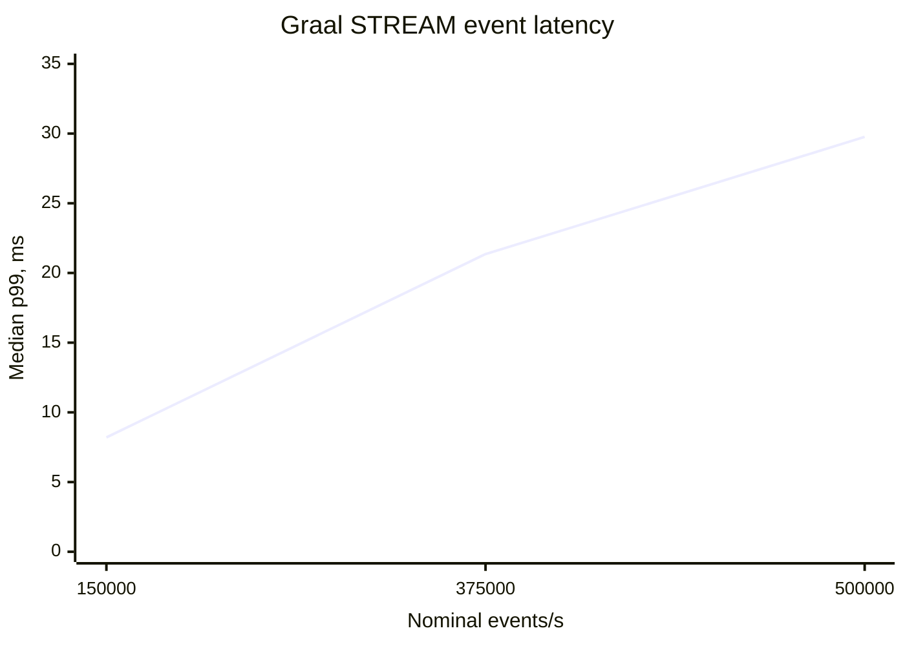

# API delivery-capacity confirmation

This note interprets the three-repetition confirmation run in
[`20260907T113447Z`](20260907T113447Z/REPORT.md). It follows the exploratory
[`API-CAPACITY-DISCOVERY.md`](API-CAPACITY-DISCOVERY.md) sweep and repeats its baseline, last pre-knee point, and
publisher-knee point in rotating order.

## Method

The synthetic server publishes shuffled Quote, Trade, TradeETH, and Summary events on loopback. Every profile uses
375 subscribed symbols and 1,500 events per publication. The nominal rate is changed only through a 10, 4, or 3 ms
publication period. Graal CXX API `STREAM_FEED`, Graal CXX API `FEED`, and the default dxFeed C API 5.11 contract are
tested in fresh processes for every run, with a 15-second warm-up and a 30-second measurement.

The comparison has two deliberate limits. The legacy API cannot receive the `TextMessage` publication marker, so it
has no marker-correlated E2E latency measurement. Its listener also performs only counters, whereas the Graal
listener performs event correlation and latency accounting in addition to counters.

## Publisher capacity

| Profile | Median actual events/s | Range | Median skipped deadlines |
|---|---:|---:|---:|
| 150k Graal STREAM | 149,427 | 149,404–149,801 | 18 |
| 150k Graal FEED | 149,463 | 149,437–149,860 | 17 |
| 375k Graal STREAM | 366,513 | 366,481–366,923 | 262 |
| 375k Graal FEED | 367,252 | 366,936–367,700 | 236 |
| 500k Graal STREAM | 478,674 | 473,874–482,035 | 661 |
| 500k Graal FEED | 478,055 | 476,021–485,678 | 670 |

The disturbed 150,000-event/s discovery result did not repeat. All six Graal baseline runs are within 0.4% of the
nominal target and have ordinary single-digit-millisecond latency.

The generator already misses approximately 2.1–2.3% of its target at nominal 375,000 and about 4.3–5.2% at nominal
500,000. Missed deadlines rise with the requested rate even though the 32-logical-processor host is not saturated.
The limiting section is the current publication cadence and serialized `publishEvents()` path. Consequently,
500,000 is a publisher/test-bed knee rather than an established client-API knee.

## Non-conflating delivery

| Nominal events/s | Graal STREAM coverage | Graal STREAM p99 | Legacy observed events/s | Legacy observed / server write |
|---:|---:|---:|---:|---:|
| 150,000 | 100.000% | 8.202 ms | 149,013 | 100.063% |
| 375,000 | 100.000% | 21.357 ms | 368,412 | 100.015% |
| 500,000 | 100.000% | 29.758 ms | 480,789 | 99.020% |

Graal `STREAM_FEED` delivered every recurring event associated with a publication marker in all nine runs. Its p99
nevertheless rises from 8.202 ms at the baseline to 29.758 ms at the publisher knee. The p99 ranges are
8.015–9.701, 18.711–33.977, and 23.140–34.989 ms, respectively. Thus latency degrades progressively before any
correlated delivery deficit appears.

Legacy delivery remains close to the server monitoring rate. The slightly above-100% ratios at 150,000 and 375,000
and the 99.020% ratio at 500,000 reflect unmatched monitoring and measurement boundaries; they cannot identify
individual lost events. There are no nonzero QD `Dropped` counters. The available evidence therefore does not show
the legacy client falling behind before the publisher.

## FEED behavior

| Nominal events/s | Listener coverage | Event p99 | Client read records/s | Server write records/s |
|---:|---:|---:|---:|---:|
| 150,000 | 99.944% | 8.543 ms | 149,134 | 149,133 |
| 375,000 | 98.627% | 9.472 ms | 367,578 | 367,757 |
| 500,000 | 98.024% | 8.694 ms | 480,131 | 475,656 |

The FEED listener sees fewer intermediate states as the rate increases, while endpoint read and write rates remain
closely matched and `Dropped = 0`. This is consistent with TICKER state supersession rather than transport loss.
Unlike `STREAM_FEED`, FEED p99 stays near 9 ms because it does not retain every intermediate state for listener
delivery. The FEED deficit must not be interpreted as the API failing at 375,000 or 500,000 events/s.

## Buffers and resources

`STREAM_FEED` server monitoring records transient buffer high-water marks of 1,398 records at 375,000 and 1,193 at
500,000, with no dropped records and exact marker-correlated delivery. FEED and legacy show no material buffer
accumulation. At nominal 500,000, median QD CPU is approximately 3.54% of the 32-processor host for the Graal STREAM
client and 3.98% for its server. Legacy reports approximately 32.0% of one core for its much smaller callback body.
The different callback work prevents treating that CPU gap as an API-only comparison.

## Conclusion

The repeated result confirms that neither non-conflating client reaches a delivery-capacity failure before the
current publisher. Graal `STREAM_FEED` remains exact but its latency tail grows with rate. Legacy delivery remains
close to the server rate, but it has no comparable latency measurement. Graal FEED increasingly supersedes
intermediate TICKER states by design without endpoint drops or an I/O-rate mismatch.

Simply requesting more than 500,000 events/s from the same publisher would mostly measure additional missed
publisher deadlines. To determine which client reaches a throughput limit first, the next test-bed change should
increase source capacity and make the listener work more comparable. Until then, the defensible result is that no
client delivery knee was observed within the publisher's achieved range.
