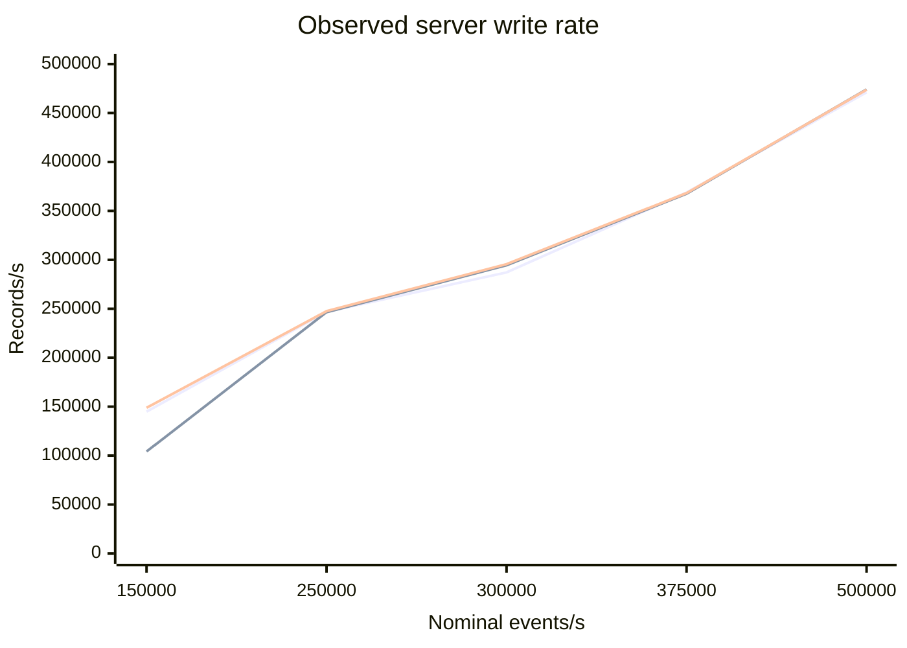

# API delivery-capacity discovery

This note interprets the single-repetition discovery run in
[`20260907T111601Z`](20260907T111601Z/REPORT.md). It compares the Graal CXX API `STREAM_FEED` and `FEED` paths with
the default dxFeed C API 5.11 contract. The synthetic server publishes shuffled Quote, Trade, TradeETH, and Summary
events on loopback. Every profile uses 375 subscribed symbols and 1,500 events per publication; only the publication
period changes.

## Question

The experiment asks whether either client stops keeping pace as the nominal recurring rate rises from 150,000 to
500,000 events/s. It is a capacity-discovery run, not a direct latency comparison: the legacy API does not expose the
benchmark's `TextMessage` publication marker, and the Graal client performs substantially more correlation and
latency-accounting work in its listener.

## Publisher throughput

| Nominal events/s | Graal STREAM server write | Graal FEED server write | Legacy server write |
|---:|---:|---:|---:|
| 150,000 | 144,849 | 104,155 | 148,795 |
| 250,000 | 246,831 | 246,514 | 247,535 |
| 300,000 | 287,134 | 294,434 | 295,537 |
| 375,000 | 368,840 | 367,567 | 368,231 |
| 500,000 | 471,106 | 474,051 | 473,765 |

The three lines are Graal STREAM, Graal FEED, and legacy. The 150,000 FEED run is an isolated disturbance rather
than a rate response: its generator reported 403 skipped deadlines, only 130,662 actual events/s over its lifetime,
and a 221 ms maximum `publishEvents()` call. The adjacent 250,000 through 500,000 results do not continue that
pattern. It must be repeated before it can be used as a baseline.

At nominal 500,000 events/s, all three server runs deliver only about 469,000–477,000 events/s. The Graal runs report
478–659 skipped deadlines. This is the first clear capacity knee, but it belongs to the current single generator and
publication path, not to either client API.

## Client delivery

| Nominal events/s | STREAM correlated coverage | FEED correlated coverage | Legacy observed / server write |
|---:|---:|---:|---:|
| 150,000 | 100.000% | 53.718% | 99.953% |
| 250,000 | 100.000% | 99.311% | 99.974% |
| 300,000 | 100.000% | 99.158% | 99.929% |
| 375,000 | 100.000% | 98.538% | 100.133% |
| 500,000 | 100.000% | 98.194% | 98.777% |

Graal `STREAM_FEED` preserves every event associated with a delivered publication marker at every tested rate.
The legacy callback rate tracks the server's monitoring rate closely through 375,000 events/s. Its 98.777% ratio at
500,000 is not yet evidence of loss because the two rates use different measurement boundaries and the legacy path
has no common marker. All client and server QD logs report `Dropped = 0`.

The gradual FEED listener-coverage reduction from 99.311% at 250,000 to 98.194% at 500,000 is consistent with normal
TICKER state supersession. It is not accompanied by a server/client I/O-rate mismatch or QD drops. FEED p99 remains
near 9–11 ms because supersession prevents every intermediate state from accumulating for listener delivery.

For the non-conflating Graal path, event p99 is 13.884 ms at 250,000, 9.165 ms at 300,000, 17.110 ms at 375,000, and
27.579 ms at nominal 500,000. The highest-rate tail grows before any correlated delivery deficit appears. The
150,000 STREAM p99 of 958.454 ms belongs to the same disturbed baseline region and requires repetition.

## Resource interpretation

At nominal 500,000, QD monitoring reports approximately 3.79% host CPU for the Graal STREAM client and 4.05% for its
server on a 32-logical-processor host. The legacy process reports 33.97% on a one-core basis, or 1.06% of the host.
These values rule out whole-host CPU saturation, but they do not make the client implementations equally expensive:
the Graal listener performs publication correlation, latency sampling, and per-type accounting, while the legacy
listener performs minimal counters and receives one event per callback.

## Conclusion and next control

The discovery run does not show either client API failing first. Up to the publisher's observed limit, Graal
`STREAM_FEED` remains exact and the legacy client remains close to the server output. Normal Graal `FEED` supersession
increases with rate, but that behavior is not a transport failure.

A repeated confirmation should use 150,000, 375,000, and 500,000 events/s: a baseline, the last rate before the
publisher knee, and the knee itself. If both non-conflating clients again keep pace, raising the nominal rate on this
single-publisher topology cannot locate a client-API limit. A later experiment would need a higher-capacity publisher
and more closely matched listener work before claiming which API has the higher capacity.

That confirmation is now available in [`20260907T113447Z`](20260907T113447Z/REPORT.md) and
[`API-CAPACITY-CONFIRMATION.md`](API-CAPACITY-CONFIRMATION.md).
