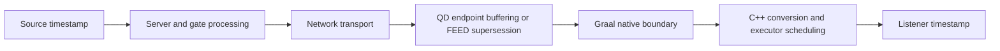

# Customer source-time latency methodology

## Executive summary

The supplied customer benchmark shows that its legacy C API and Graal C++ API paths produced different latency
histograms during live-market runs. It does not isolate the API as the cause of that difference.

The most consequential issue is the sample-selection rule. One timestamp maximum is shared by every Trade and
TradeETH symbol, and an event is measured only when its millisecond source time is strictly greater than that global
maximum. Valid events from other symbols, as well as events sharing the same millisecond timestamp, are therefore
discarded. The retained sample depends on callback order, batching, thread scheduling, and symbol mix.

A controlled loopback experiment applied this global rule, an instrument-aware rule, and no rule to the exact same
callbacks. At 150,000 recurring events/s, the global rule retained only about 0.133% of Trade and TradeETH
observations with normal callback batching. It also changed the reported latency distribution. The customer
histogram consequently describes a small, order-dependent subset rather than the complete Trade/TradeETH stream.

The controlled tests did not reproduce unexplained second-scale latency spikes in the Graal C++ API. This is useful
negative evidence for the isolated API path, but it does not rule out stalls introduced by a production server,
network, clock alignment, burst shape, or executor configuration.

## What the customer measured

The supplied project runs the legacy C API 5.11.0 and Graal C++ API 5.0.0 concurrently in one Windows process and
connects them to the same live endpoint. It subscribes to a large instrument universe and records
`system_clock::now() - Trade.time` for Trade and TradeETH events.

That metric is an operational source-to-listener latency. It contains all of the following:



It is not an API-only measurement unless the other stages are controlled or instrumented separately.

## Main limitations of the supplied comparison

1. **The events are not paired.** No stable event identity ties a legacy callback to the corresponding Graal
   callback. Different accepted sample counts therefore represent different event populations.
2. **The timestamp filter is global.** Source time can be monotonic within an instrument series without being
   globally monotonic across thousands of symbols and two event types. Equal millisecond timestamps are rejected as
   well.
3. **The legacy callback consumes only the first item.** Its callback receives `data_count`, but the supplied handler
   does not iterate over it. If one-event callbacks are an expected legacy invariant, the benchmark should record or
   assert that invariant.
4. **Subscription equivalence is not demonstrated.** The legacy API internally expands several root-symbol
   subscriptions to composite and A--Z regional records. The Graal side creates those symbols explicitly. Resolved
   records, endpoint roles, and TimeAndSale HISTORY snapshot completion still need to be compared explicitly.
5. **Live traffic is uncontrolled.** Runs made at different times do not hold rate, burstiness, symbol mix, snapshot
   traffic, or market state constant. Running both clients in one process also introduces shared-resource contention.
6. **The histogram hides edge cases.** Negative values enter the first bin, values at or above ten seconds enter one
   terminal bin, and the exported percentages are rounded. Raw observations are unavailable for paired analysis.
7. **Operational evidence is missing.** The customer harness does not record QD read/write rates, `Dropped`, buffer
   depth, callback batch sizes and duration, CPU/RSS, connection readiness, or snapshot completion.

The legacy subscription expansion is visible in the
[old C API record mapping](https://github.com/dxFeed/dxfeed-c-api/blob/299eced3327deef995694d9e7c65319096f6e3e8/src/EventData.c#L177).

## Our measurement design

The controlled benchmark is not a synthetic copy of the customer's live test. It deliberately decomposes the
investigation into separate questions so that delivery, latency, sample selection, batching, and resource pressure
are not inferred from one histogram.

The publisher and client run as separate native processes on the same host and communicate over a QD network
connection on loopback. This removes the production server topology, external network, and cross-machine clock skew,
while retaining event serialization, QD transport and endpoint processing, the Graal native boundary, C++ event
conversion, executor scheduling, and listener invocation.

The benchmark records the following independent evidence:

| Measurement layer | What is recorded | Question answered |
|---|---|---|
| Publication-correlated E2E latency | A nanosecond Unix timestamp is carried by a `TextMessage` in the same publication; synthetic correlation fields associate Quote, Trade, TradeETH, and Summary with that publication | How long did a known synthetic publication take to reach the C++ listener? |
| Native source-time control | Trade and TradeETH carry their normal millisecond source time; all, per-series, and customer-global selection are applied to the same callback | How much does the customer's selection algorithm change the population and its distribution? |
| Delivery accounting | Published events, listener-observed events, full/partial/empty correlated publications, excess and uncorrelated events | Was a latency distribution calculated from the expected delivered population? |
| Callback behavior | Callback count, events per callback, callback duration, and configured native batch limit | Did batching or listener invocation overhead change? |
| QD monitoring | Read/write records/s, data lag, buffers, `Dropped`, CPU, and subscriptions where available | Is a listener deficit accompanied by transport pressure or a QD-reported drop? |
| Process resources | Client/server CPU and RSS sampled over the measurement interval | Was the process near an obvious CPU or memory limit? |

The nanosecond marker is the primary controlled latency clock. The Trade/TradeETH source-time measurement is a
secondary methodology control and is deliberately reduced to the customer's millisecond resolution. The two must
not be mixed: one measures a known publication path, while the other demonstrates what the customer's filter does
to source-time observations.

Each suite records its objective, changed variable, controls, success criteria, and limitations in `suite.conf`.
Runs use an explicit warm-up and measurement boundary, fixed-duration windows, repeated scenarios, deterministic
event ordering, and the same configured offered load. The analyzer reports run-level values, medians and ranges
across repetitions, uncapped latency percentiles, upper-IQR outlier counts, delivery integrity, and monitoring data.

`STREAM_FEED` is used as the exact-delivery control. `FEED` is measured separately because normal TICKER semantics
may supersede intermediate states before listener delivery. A callback batch limit of one is an intentional stress
variable, not an assumed production default.

This design can isolate regressions in the controlled local client/API path and can show when a measurement
algorithm changes its own sample. It cannot reproduce a production-only server, network, clock, or live-burst fault
unless that condition is recorded or deliberately injected.

## Controlled reproduction of the selection rule

The benchmark publishes Quote, Trade, TradeETH, and Summary for 375 shared symbols every 10 ms: 1,500 events per
publication and 150,000 recurring events/s. Trade and TradeETH carry the same millisecond source timestamp for a
publication. Publication order is deterministically shuffled. Three methods are evaluated online over the same
callbacks:

- `all-trade-events`: retains every timestamped Trade and TradeETH observation;
- `per-series-strict`: requires strict advancement only within one `(event type, symbol)` series;
- `customer-global-strict`: reproduces one strict maximum shared across the complete mixed stream.

The suite contains three independent repetitions per scenario, a 15-second warm-up, a 30-second measurement, and
5-second QD/process monitoring. Values below are medians across repetitions.

| Scenario | Method | Observed | Accepted | Acceptance | p50 | p99 | p99.9 | Maximum |
|---|---|---:|---:|---:|---:|---:|---:|---:|
| FEED, optimal batch | all events | 2,252,477 | 2,252,477 | 100.0000% | 3 ms | 9 ms | 16 ms | 19 ms |
| FEED, optimal batch | per-series strict | 2,252,477 | 2,252,477 | 100.0000% | 3 ms | 9 ms | 16 ms | 19 ms |
| FEED, optimal batch | customer global strict | 2,252,477 | 3,005 | 0.1334% | 2 ms | 7.85 ms | 14.003 ms | 18 ms |
| STREAM_FEED, optimal batch | all events | 2,256,000 | 2,256,000 | 100.0000% | 3 ms | 9 ms | 16 ms | 19 ms |
| STREAM_FEED, optimal batch | customer global strict | 2,256,000 | 3,008 | 0.1333% | 3 ms | 8 ms | 14.998 ms | 16 ms |
| FEED, batch limit 1 | all events | 520,633 | 520,633 | 100.0000% | 7 ms | 16 ms | 22 ms | 48 ms |
| FEED, batch limit 1 | customer global strict | 520,633 | 2,925 | 0.5618% | 3 ms | 12 ms | 18 ms | 21 ms |

A 30-second run at a 10 ms cadence contains approximately 3,000 publications. The roughly 3,000 globally accepted
observations are therefore explained by the filter advancing about once per publication. With optimal batching it
rejects almost all of the 750 Trade/TradeETH events in each publication. The lower p50 and tail are a selection
effect, not evidence that the globally filtered stream is faster.

Full run data:

- [generated report](20260907T160901Z/REPORT.md)
- [suite configuration](20260907T160901Z/suite.conf)
- [per-run method data](20260907T160901Z/source-time-method-runs.csv)
- [aggregated method comparison](20260907T160901Z/source-time-method-comparison.csv)

## FEED delivery and transport interpretation

With optimal batching, normal `FEED` listener coverage was 99.903%, while `STREAM_FEED` delivered exactly 100% of
the correlated recurring publications. Both the client and server reported `Dropped = 0`, and their QD read/write
rates were close to the offered rate. This makes counted QD transport loss unlikely; it does not turn the FEED
listener deficit into a proven drop.

With a native callback batch limit of one, QD still read about 149,000 records/s and reported zero drops, but the
FEED listener observed only 23.256% of correlated recurring events. Client CPU exceeded one logical core and latency
increased. The result is consistent with intermediate TICKER states being superseded on the FEED delivery path while
the transport continues to consume records. Such normal FEED behavior is not required to increment `Dropped`.

The source-level distinction between FEED and STREAM_FEED is discussed in
[QD FEED delivery path](QD-FEED-DELIVERY-PATH.md). The test cannot localize every superseded state to one exact
server-side or client-side queue without record-level tracing.

## What the broader benchmark establishes

- Repeated controlled runs provide latency percentiles, delivery accounting, callback shape, process CPU/RSS, and
  QD monitoring instead of only a rounded histogram.
- A fixed 150,000 events/s controlled path does not show the customer's large unexplained tail.
- Increasing delivery load identifies capacity limits and expected queueing, but the repeated capacity test does not
  reveal an unexplained release regression. See [API capacity confirmation](API-CAPACITY-CONFIRMATION.md).
- Delivery-only comparisons of C++ API/Native SDK/QD release stacks do not show a monotonic regression through
  C++ API v8.0.0. See [SDK version comparison](SDK-VERSION-COMPARISON.md).
- A large mostly inactive subscription universe affects installation time and memory separately from the active
  update rate. See [inactive subscription cardinality](INACTIVE-SUBSCRIPTION-CARDINALITY.md).
- Synthetic TimeAndSale HISTORY tests cover snapshot-to-live transition and overlap, but do not reproduce an actual
  production OPRA recording. See [TimeSeries overlap](TIME-SERIES-OVERLAP.md).

These findings narrow the question; they do not prove that the production environment cannot produce latency
spikes. A conclusive production comparison requires paired event identities or a captured/replayable stream plus
stage-specific timestamps.

## How to reproduce

Build the project according to the platform instructions in the [README](../README.md), then run:

```text
latency_runner --binary-directory <directory-containing-the-binaries> \
  --config tools/customer-methodology.conf
```

On Windows with the documented Visual Studio build directory, for example:

```powershell
.\cmake-build-v8\Release\latency_runner.exe `
  --binary-directory .\cmake-build-v8\Release `
  --config .\tools\customer-methodology.conf
```

The runner starts an isolated server and client for every profile and repetition, captures their logs, invokes the
analyzer, and writes a timestamped directory under `benchmark-results`. Compare the experiment definition copied to
`suite.conf`, the generated `REPORT.md`, and the aggregate CSV files. Run on an otherwise idle host and record the
machine/environment file before comparing results from different systems. The configured nine measurement runs take
approximately eight minutes after the binaries have been built, depending on process startup time and the host.

## Requirements for a stronger customer rerun

The next live comparison should retain every observation, identify `(API, event type, symbol, stable event ID,
source time, receive time, callback ID)`, and pair identical events between APIs. It should report unmatched events
separately, verify callback batch sizes, wait for connection and snapshot readiness, preserve negative and extreme
latencies, and capture QD/process telemetry. The source-to-listener metric and direct API/conversion timing should be
reported as separate measurements.
