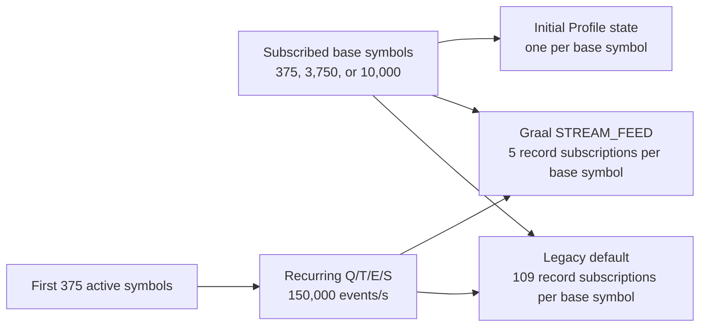

# Mostly idle subscription-cardinality comparison

This note interprets the repeated
[`20260907T145209Z`](20260907T145209Z/REPORT.md) benchmark. The experiment was added to separate two quantities that
were coupled in the earlier cardinality suite: the number of subscribed instruments and the number of instruments
that actually receive updates.

## Question

The customer subscribed to a large symbol universe, but it is not known whether every subscribed instrument was
active during the measurement. Increasing both the subscription and the active publication universe would therefore
test a stronger workload than the reported case. This experiment asks a narrower question: does a larger mostly idle
subscription, by itself, degrade steady-state delivery through the Graal CXX API or the legacy C API?

## Method

Every profile publishes Quote, Trade, TradeETH, and Summary for the same first 375 base symbols. Each publication
contains 1,500 events and occurs every 10 ms, for a nominal 150,000 events/s. Only the subscribed universe changes:
375, 3,750, or 10,000 base symbols. One initial Profile is published for every subscribed base symbol before the
15-second warm-up. The measurement then runs for 30 seconds and is repeated three times in rotating order.

The clients contain only delivery counters and process-resource sampling. The Graal client uses `STREAM_FEED` and
retains the vector callback shape. The legacy 5.11 client uses the C API's default contract and receives one event per
callback. This is deliberately not a timestamp-based latency comparison because the legacy API cannot receive the
`TextMessage` publication marker used by the full Graal benchmark.

## Delivery and process resources

All 18 runs completed successfully. Values below are medians across the three repetitions.

| Subscribed base symbols | Graal events/s | Legacy events/s | Graal average callback batch | Legacy callback batch | Graal CPU, one-core basis | Legacy CPU, one-core basis | Graal mean RSS | Legacy mean RSS |
|---:|---:|---:|---:|---:|---:|---:|---:|---:|
| 375 | 149,191 | 148,995 | 359 | 1 | 26.952% | 12.426% | 96.212 MiB | 7.295 MiB |
| 3,750 | 149,085 | 149,744 | 289 | 1 | 31.664% | 12.591% | 97.604 MiB | 17.979 MiB |
| 10,000 | 149,129 | 149,488 | 283 | 1 | 31.068% | 12.292% | 131.574 MiB | 36.797 MiB |

Observed delivery remains close to the achieved source rate for both clients. From 375 to 10,000 subscribed symbols,
the Graal median changes by -0.04% and the legacy median by +0.33%. Those small, non-monotonic differences do not show
a subscription-cardinality delivery regression.

The Graal callback is somewhat more fragmented at the larger cardinalities: its median average batch decreases from
359 to 283 events, while the maximum callback batch remains similar at 935 to 958 events. This did not reduce delivered
throughput. The legacy callback remains fixed at one event by API design, so callback counts cannot be compared as a
proxy for delivery work.

Memory is the clear cardinality-dependent cost. Graal mean RSS increases by 35.362 MiB from 375 to 10,000 symbols,
or 36.8%. Legacy mean RSS increases by 29.502 MiB, or 404.4% relative to its much smaller baseline. The legacy growth
is close to linear over these points. The Graal increase is not linear, so these three results are insufficient for a
per-symbol memory estimate. Graal CPU is about four percentage points of one core higher at 10,000 than at 375, but
the 3,750 result is slightly higher than the 10,000 result. Legacy CPU stays effectively flat. Neither path approaches
a client CPU limit on this 32-logical-processor host.

## QD subscription state

| Subscribed base symbols | Graal server subscriptions | Legacy server subscriptions | Graal server storage | Legacy server storage |
|---:|---:|---:|---:|---:|
| 375 | 1,875 | 40,875 | 0 | 1,875 |
| 3,750 | 18,750 | 408,750 | 0 | 5,250 |
| 10,000 | 50,000 | 1,090,000 | 0 | 11,500 |

The counters confirm the legacy C API behavior directly at the synthetic server. Graal subscribes to five records per
base symbol: Quote, Trade, TradeETH, Summary, and Profile. Legacy subscribes to 109 records per base symbol: Profile,
plus the four recurring market types expanded to the composite and 26 regional symbols
(`1 + 4 × 27 = 109`). At 10,000 base symbols, the legacy connection therefore creates 1.09 million server-side
subscriptions even though only 1,500 recurring events are published every 10 ms.

Legacy server storage follows `subscribed Profiles + four active market states`: 375 + 1,500, 3,750 + 1,500, and
10,000 + 1,500. Graal `STREAM_FEED` reports no storage. This is a contract-level difference, not evidence of a leak.

The expanded legacy subscription is visible as a startup burst, but it does not multiply steady-state traffic. Server
write rates remain approximately 149,000 records/s for both paths and server CPU remains around 3.3% to 3.4% of the
host. Every run completed initial Profile delivery before warm-up. The suite verifies startup completion but does not
yet record setup duration as a comparison metric, so it cannot quantify startup scaling from this report alone.

## Drops and integrity

The server reports `Dropped = 0` for every profile. The Graal client also reports `Dropped = 0`, and its QD read rate
tracks the server write rate. Legacy 5.11 does not expose equivalent parseable client monitoring in this setup, so its
client-side QD drop counter is unavailable rather than zero. Its callback count nevertheless tracks the server's
recurring write count at every cardinality.

This result applies to `STREAM_FEED` delivery. It does not depend on FEED conflation, and it does not establish
timestamp latency equivalence between APIs. It also excludes TimeAndSale history, subscription churn, production
multiplexors, remote network effects, and a workload where all 10,000 instruments tick concurrently.

## Interpretation for the customer investigation

The experiment reproduces an important structural property of the customer's legacy client: a base-symbol
subscription is expanded to regional and composite records. It also reproduces a large subscribed universe without
artificially increasing the active event rate. Under those controlled conditions, neither API loses recurring
throughput as the mostly idle universe grows to 10,000 symbols. The extra legacy subscriptions primarily cost setup
state and memory, not recurring bandwidth.

Consequently, the reported difference between the customer's old and new clients is not explained by the number of
mostly idle subscriptions alone at this offered rate. Other differences remain material: the customer's actual active
symbol distribution and event mix, FEED versus STREAM_FEED semantics, TimeAndSale history, and the customer's counting
logic. In particular, rejecting a Trade whenever its timestamp is not greater than the previously accepted Trade
timestamp across all instruments can undercount valid events. Event time is not required to be globally monotonic
between different symbols.

The next useful extension is a controlled active-density sweep: retain the same subscribed universes and total offered
rate, but vary how many symbols receive recurring updates. That would show whether sparse and dense activity produce
different batching or routing costs without conflating the result with a higher event rate. Only after that control
should the source rate be increased or TimeAndSale history be added.

## Source data

- Generated report: [`20260907T145209Z/REPORT.md`](20260907T145209Z/REPORT.md)
- Per-run delivery data: [`20260907T145209Z/delivery-runs.csv`](20260907T145209Z/delivery-runs.csv)
- Aggregated delivery data: [`20260907T145209Z/delivery-comparison.csv`](20260907T145209Z/delivery-comparison.csv)
- Process resources: [`20260907T145209Z/client-resource-comparison.csv`](20260907T145209Z/client-resource-comparison.csv)
- QD monitoring: [`20260907T145209Z/monitoring-comparison.csv`](20260907T145209Z/monitoring-comparison.csv)
- Exact suite settings: [`20260907T145209Z/suite.conf`](20260907T145209Z/suite.conf)

