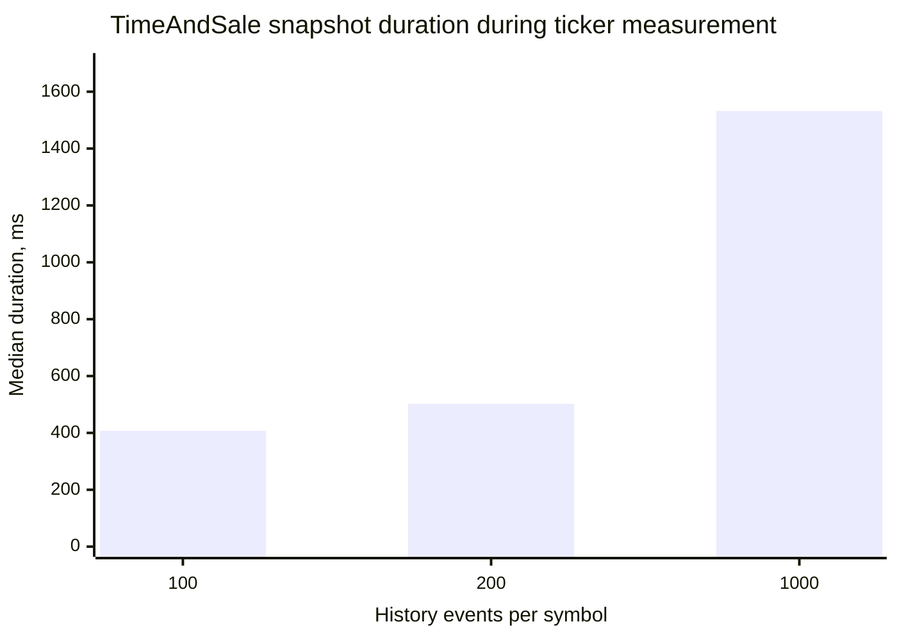
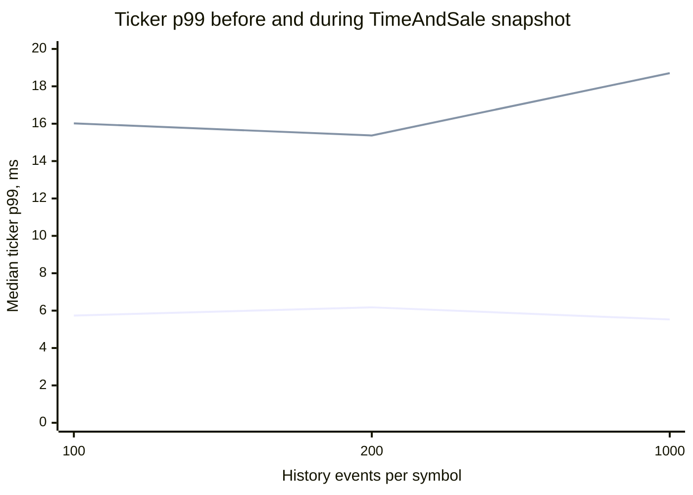

# In-measurement TimeAndSale HISTORY overlap findings

This note interprets the controlled CXX API v8.0.0 / Graal Native SDK 3.2.13 / QD 3.353 run in
[`20260907T095845Z`](20260907T095845Z/REPORT.md). The aggregate inputs are
[`snapshot-overlap-runs.csv`](20260907T095845Z/snapshot-overlap-runs.csv),
[`time-series-runs.csv`](20260907T095845Z/time-series-runs.csv), and
[`monitoring-summary.csv`](20260907T095845Z/monitoring-summary.csv).

## Question and method

The experiment asks whether delivery of a TimeAndSale HISTORY snapshot interferes with ticker data that is already
being processed by the new C++ API. It deliberately starts the Q/T/E/S measurement first and adds a separate
TimeAndSale subscription ten seconds later. The client divides marker-correlated ticker observations into `before`,
`during`, and `after` phases at the subscription call and completion of the last per-symbol snapshot.

Every profile uses 375 active symbols and publishes 375 Quote, 375 Trade, 375 TradeETH, 375 Summary, and 375
TimeAndSale events every 10 ms. Before the TimeAndSale subscription, 150,000 Q/T/E/S events/s are eligible for
delivery. Afterwards, the 37,500 live TimeAndSale events/s raise the offered total to 187,500 events/s. The only
profile variable is the bounded snapshot depth: 100, 200, or 1,000 events per symbol. Each profile is repeated three
times in rotating order on loopback with the FEED role and zero configured aggregation.

## Snapshot delivery and ticker latency

Values below are medians across three repetitions. The multiplier divides the median `during` p99 by the median
`before` p99.

| History events per symbol | Snapshot events | Snapshot callbacks | Snapshot duration | Ticker p99 before | Ticker p99 during | During / before | Ticker p99 after |
|---:|---:|---:|---:|---:|---:|---:|---:|
| 100 | 37,891 | 53 | 407.528 ms | 5.738 ms | 16.020 ms | 2.79x | 14.615 ms |
| 200 | 75,834 | 96 | 502.112 ms | 6.177 ms | 15.370 ms | 2.49x | 11.553 ms |
| 1,000 | 374,975 | 424 | 1,532.120 ms | 5.528 ms | 18.704 ms | 3.38x | 8.094 ms |

The first line in the latency chart is `before`; the second is `during`. Every one of the nine paired repetitions
has a higher `during` p99 than its own `before` p99. The per-run ratios range from 1.75x to 4.38x, so the transient
increase is consistent even though its exact magnitude varies. Snapshot duration also increases with depth, from
about 0.4 seconds for 100 retained events per symbol to about 1.5 seconds for 1,000.

The `after` phase is not a return-to-identical-baseline measurement. TimeAndSale remains subscribed and adds 25% to
the live offered event rate relative to the Q/T/E/S-only `before` phase. Its p99 is higher than `before` in every
repetition, but this run cannot divide that difference into residual snapshot effects and the normal cost of the
additional live TimeAndSale stream. The earlier steady-state
[`TimeAndSale scaling run`](TIME-SERIES-SCALING.md) reports comparable post-snapshot p99 values after a 15-second
warm-up, which is consistent with an initial burst followed by a higher-load steady state.

## Integrity, delivery, and resources

All nine runs completed all 375 requested symbol snapshots. There were no duplicate indices, no live events before
the corresponding per-symbol snapshot completion, and no clock anomalies. Every bounded range ended with
`SNAPSHOT_SNIP`, as expected. Client and server QD monitoring both reported `Dropped = 0`; server write and client
read rates closely matched. Recorded QD buffers remained small, with maxima of 132 records on the client and 238 on
the server.

The whole-run FEED listener coverage medians are 99.500%, 99.626%, and 99.510% for depths 100, 200, and 1,000. This
gap is not a transport-loss counter: FEED may supersede intermediate ticker states before listener delivery. The raw
`during` phase coverage is lower, but those sub-second phase counters can split a publication from its marker at the
phase boundary. Every `during` row has zero listener deficit, so phase coverage must not be presented as evidence of
dropped events. Whole-run integrity and QD `Dropped` are the applicable checks.

The Graal client used roughly 42% of one logical core during the complete measurement, or about 1.3% of this 32-core
host. QD monitoring likewise shows low process CPU, and neither endpoint exhibits a sustained buffer. The transient
p99 increase therefore does not require host CPU or loopback network saturation; queueing, scheduling, and burst
processing inside the end-to-end client path are sufficient.

Transient client RSS maximum during the snapshot phase increases from about 110 MiB at depth 100 to 159 MiB at
depth 1,000. Later RSS maxima are not monotonic by configured snapshot depth because the live HISTORY collector keeps
accumulating records after subscription and converges to approximately 1,000 records per symbol in all profiles.
Those later values include QD history storage and allocator retention, not merely the listener's snapshot objects.

## Customer-request interpretation

Under these controlled local conditions, the new C++ API completes a large concurrent HISTORY snapshot without QD
drops, corrupted ordering, premature live delivery, or large isolated stalls. It nevertheless shows a measurable
and repeatable increase in ticker listener latency while the snapshot is delivered. Consequently, a customer
TimeAndSale subscription used only to increase traffic can influence ticker-latency measurements even when the
server, transport, and host are not visibly saturated.

This does not reproduce the customer's complete topology or validate the customer's latency calculation. The test
uses a synthetic publisher and loopback rather than a production multiplexer and network path; all 375 symbols are
active at 100 updates/s, whereas a large real subscription may contain many quiet instruments. The customer's use of
one global monotonic Trade timestamp across multiple instruments remains a separate measurement flaw: event time is
ordered per instrument, not globally across all symbols. The present result isolates a real HISTORY-overlap effect
without establishing that it caused the customer's reported outliers.

## Next controlled step

Repeat the delayed-subscription experiment with the TimeAndSale symbols removed immediately after all per-symbol
snapshots complete. That makes the Q/T/E/S-only `before` and `after` phases load-equivalent at 150,000 events/s. It
will show whether ticker p99 returns to baseline after the HISTORY burst and separate recovery or allocator effects
from the continuing 37,500 events/s live TimeAndSale stream. The existing keep-subscribed run remains the closer
model for a customer that continues consuming TimeAndSale after its initial snapshot.
