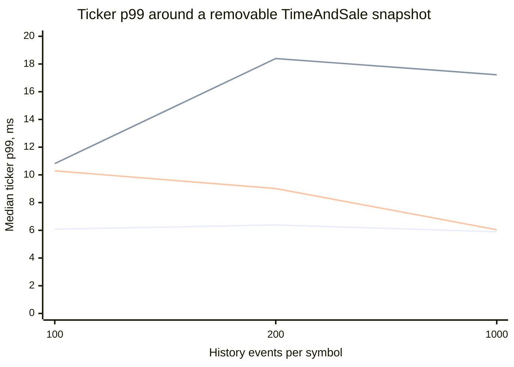

# Matched TimeAndSale HISTORY recovery findings

This note interprets the controlled CXX API v8.0.0 / Graal Native SDK 3.2.13 / QD 3.353 run in
[`20260907T104556Z`](20260907T104556Z/REPORT.md). The aggregate inputs are
[`snapshot-overlap-runs.csv`](20260907T104556Z/snapshot-overlap-runs.csv),
[`time-series-runs.csv`](20260907T104556Z/time-series-runs.csv), and
[`monitoring-summary.csv`](20260907T104556Z/monitoring-summary.csv). The earlier retained-subscription control is
documented in [`TIME-SERIES-OVERLAP.md`](TIME-SERIES-OVERLAP.md).

## Question and method

The previous overlap experiment established that ticker p99 rises while a delayed TimeAndSale HISTORY snapshot is
delivered, but its `after` phase retained the live TimeAndSale subscription. That changed the subscribed recurring
load from 150,000 Q/T/E/S events/s before the snapshot to 187,500 Q/T/E/S/N events/s afterwards.

This experiment removes all TimeAndSale symbols immediately after the last requested per-symbol snapshot completes.
The `before` and `after` phases therefore have the same 375-symbol Q/T/E/S subscription and nominal 150,000 events/s.
Only the short `during` phase contains the bounded HISTORY burst and live TimeAndSale updates. History depth is 100,
200, or 1,000 events per symbol. Each profile is repeated three times in rotating order on loopback with the FEED role
and zero configured aggregation.

## Snapshot interference and recovery

The table reports medians across three repetitions. Ratios are medians of the three within-run ratios, rather than
ratios of independently aggregated values.

| History events per symbol | Snapshot events | Snapshot duration | Ticker p99 before | Ticker p99 during | Paired during / before | Ticker p99 after | Paired after / before | After listener coverage | After RSS mean |
|---:|---:|---:|---:|---:|---:|---:|---:|---:|---:|
| 100 | 37,893 | 417.873 ms | 6.079 ms | 10.814 ms | 2.15x | 10.291 ms | 1.69x | 99.176% | 240.481 MiB |
| 200 | 75,717 | 573.592 ms | 6.387 ms | 18.396 ms | 2.73x | 9.014 ms | 1.52x | 99.220% | 242.685 MiB |
| 1,000 | 374,982 | 1,190.410 ms | 5.893 ms | 17.224 ms | 3.79x | 6.045 ms | 1.17x | 99.289% | 268.188 MiB |

The three chart lines are `before`, `during`, and `after`. Every one of the nine paired repetitions has a higher
`during` p99 than its own `before` p99. This confirms a repeatable transient HISTORY-delivery effect without requiring
host CPU or loopback network saturation. Seven of nine runs have a lower `after` p99 than `during`, so removing the
TimeAndSale symbols usually reduces the tail after the burst.

Immediate recovery is not exact in every run: eight of nine `after` p99 values remain above their own `before` value.
However, the residual does not have a positive depth response. The paired `after / before` median falls from 1.69x at
depth 100 to 1.17x at depth 1,000, and post-snapshot CPU does not remain elevated with depth. The result therefore does
not support a persistent degradation proportional to snapshot size. Run-to-run scheduling, FEED state supersession,
and post-burst allocation or garbage-collection state remain plausible contributors to the residual tail.

## Effect of retaining live TimeAndSale

The prior overlap suite and this suite ran separately, so their absolute values are not paired measurements. The
comparison is nevertheless directionally consistent at every depth.

| History events per symbol | After p99 with TnS retained | After p99 with TnS removed | Difference |
|---:|---:|---:|---:|
| 100 | 14.615 ms | 10.291 ms | -29.6% |
| 200 | 11.553 ms | 9.014 ms | -22.0% |
| 1,000 | 8.094 ms | 6.045 ms | -25.3% |

```mermaid
xychart-beta
    title "Post-snapshot ticker p99 by TimeAndSale state"
    x-axis "History events per symbol" [100, 200, 1000]
    y-axis "Median ticker p99, ms" 0 --> 16
    bar [14.615, 11.553, 8.094]
    bar [10.291, 9.014, 6.045]
```

The first bars retain TimeAndSale; the second remove it. The 22–30% lower `after` p99 with removal indicates that the
ongoing live TimeAndSale load contributed to the previous post-snapshot plateau. It did not account for the entire
within-run difference from `before`.

## Integrity, delivery, and resources

All nine runs passed, completed all 375 requested symbol snapshots, and recorded that the TimeAndSale symbols were
actually removed. There were no duplicate indices, premature live events, or clock anomalies. Client and server QD
monitoring both reported `Dropped = 0`. Aggregate server write and client read rates closely match: approximately
150,000 records/s for depths 100 and 200, and about 157,700 records/s for depth 1,000 because five-second monitoring
intervals include part of its longer HISTORY burst.

The TimeAndSale `Live p99` column in the generated report covers only per-symbol live-cutover events received while
other symbol snapshots were still in progress. Since the subscription is removed at global completion, that value is
not interpreted as post-snapshot steady-state TimeAndSale latency.

FEED listener coverage is approximately 99.7–99.8% before and 99.18–99.29% after. This small difference is not a
transport-loss count. QD reports no drops, and FEED may supersede an earlier TICKER state before listener delivery.
The `during` phase is sub-second to about 1.2 seconds, so phase-boundary correlation can also distort short-interval
coverage. Whole-run integrity and QD counters remain the applicable loss checks.

Mean client RSS remains higher after the snapshot: approximately 240–268 MiB versus 143–145 MiB before it. This is
consistent with QD/JVM heap growth and allocator retention after materializing the HISTORY range. It is not by itself
evidence of a leak, and the three-run experiment cannot attribute individual p99 observations to garbage collection.

## Customer-request interpretation

The new C++ API path can show a measurable and repeatable increase in ticker listener latency while a concurrent
TimeAndSale HISTORY snapshot is delivered. Removing TimeAndSale improves post-snapshot latency relative to leaving the
live stream subscribed, which confirms that the customer's traffic-only TimeAndSale subscription can influence the
measurement after the initial snapshot as well as during it.

The experiment still does not reproduce the customer's topology or prove that the API caused the reported outliers.
It uses a synthetic loopback server, all 375 symbols are active at 100 updates/s, and no QD drops occur. The observed
tails are in the tens of milliseconds, without a separate population of extreme stalls. The customer's global
monotonic Trade timestamp filter across multiple instruments also remains invalid because event time is ordered per
instrument, not globally across the complete subscription.

## Next controlled steps

1. Split the post-snapshot interval into short fixed windows. This can distinguish a brief recovery transient from a
   stable `after` plateau and correlate it with RSS and CPU evolution.
2. Run a separate Q/T/E/S load sweep, keeping symbol universe, cadence, and batch shape fixed, to find where each
   client path loses latency or delivery stability. Candidate offered rates are 150k, 225k, 300k, and 450k events/s.
3. Treat the legacy C API comparison as a delivery-capacity comparison rather than identical API semantics: it emits
   one event per callback, expands regional subscriptions internally, lacks the new FEED conflation mechanism, and
   cannot use the same `TextMessage` marker contract.
