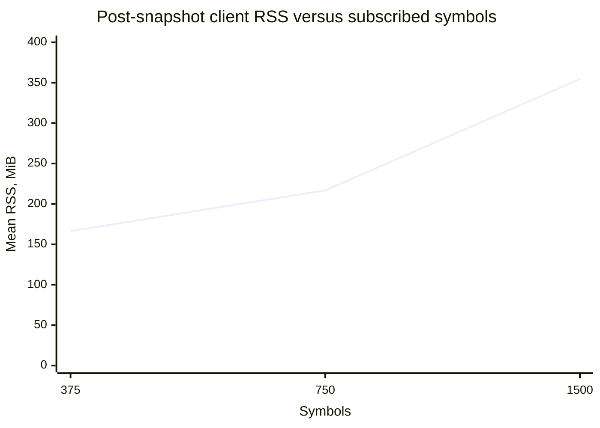
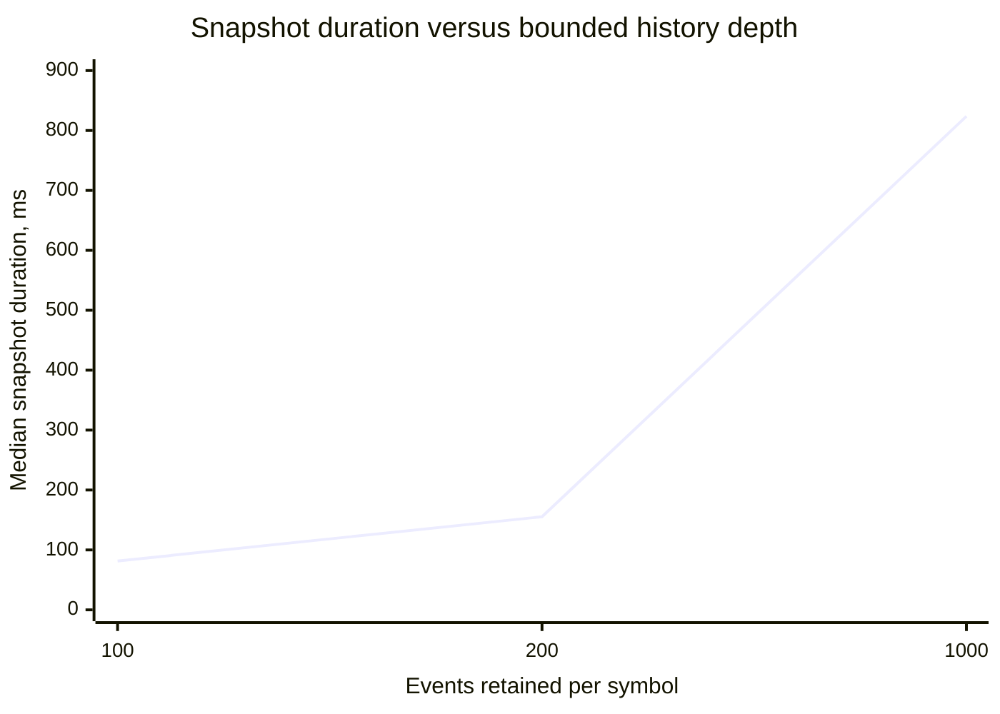

# TimeAndSale HISTORY scaling findings

This note interprets the controlled CXX API v8.0.0 / Graal Native SDK 3.2.13 / QD 3.353 run in
[`20260906T230501Z`](20260906T230501Z/REPORT.md). The raw aggregate inputs are
[`latency-comparison.csv`](20260906T230501Z/latency-comparison.csv),
[`time-series-comparison.csv`](20260906T230501Z/time-series-comparison.csv), and
[`monitoring-comparison.csv`](20260906T230501Z/monitoring-comparison.csv).

## What was held constant

Every profile offered 375 `Quote`, 375 `Trade`, 375 `TradeETH`, 375 `Summary`, and 375 `TimeAndSale` events every
10 ms: 187,500 events/s in total. The FEED role, zero aggregation, 10.5-second server prefill, 15-second post-snapshot
warm-up, 30-second measurement interval, loopback transport, compiler, and release stack were unchanged. Each point
was repeated three times in rotating order.

Unless a range is shown explicitly, the tables report the median across the three repetitions.

The server actually sustained approximately 184,600–186,100 events/s (98.5–99.3 publications/s), so this is the
measured offered rate rather than a claim that the Windows generator reached exactly 187,500 events/s.

## Cardinality sweep

History depth was fixed at 200 events per symbol.

| Symbols | Snapshot events | Snapshot duration | Ticker p99 | Live TnS p99 | Client CPU, one core | Post-snapshot RSS mean / max |
|---:|---:|---:|---:|---:|---:|---:|
| 375 | 75,577 | 155.363 ms | 16.377 ms | 16.765 ms | 36.956% | 166.408 / 229.297 MiB |
| 750 | 150,311 | 308.890 ms | 16.107 ms | 16.477 ms | 36.633% | 216.754 / 285.805 MiB |
| 1,500 | 301,128 | 580.915 ms | 6.840 ms | 6.290 ms | 37.278% | 354.533 / 406.266 MiB |

Snapshot size and median delivery time scaled close to linearly. Post-snapshot client RSS also increased strongly
with the subscribed symbol universe, while measured client CPU remained essentially flat.

Snapshot event counts can be slightly larger than `symbols × history limit`: the limit bounds retained history at
subscription time, while live events may arrive for symbols whose individual snapshot has not yet reached
`SNAPSHOT_END`. The snapshot is consistent per symbol rather than one globally atomic transfer.

Steady-state p99 did **not** degrade monotonically. This cardinality sweep is not a pure history-size experiment:
the same 375 events of each type rotate across 375, 750, or 1,500 symbols. An individual record is therefore updated
approximately every 10, 20, or 40 ms. The lower p99 at 1,500 symbols and disappearance of FEED listener deficit are
consistent with less frequent overwriting of the same record, but the current marker-based measurement cannot locate
where FEED supersession occurs and cannot prove that explanation.

## Depth sweep

The subscribed universe was fixed at 375 symbols, so per-record update frequency stayed constant.

| History per symbol | Snapshot events | Snapshot callbacks | Snapshot duration | Ticker p99 | Live TnS p99 | Post-snapshot RSS mean / max |
|---:|---:|---:|---:|---:|---:|---:|
| 100 | 37,777 | 44 | 81.460 ms | 16.319 ms | 16.827 ms | 164.957 / 230.582 MiB |
| 200 | 75,577 | 86 | 155.363 ms | 16.377 ms | 16.765 ms | 166.408 / 229.297 MiB |
| 1,000 | 374,981 | 424 | 823.662 ms | 10.351 ms | 10.401 ms | 177.962 / 241.223 MiB |

Snapshot volume, callback count, and delivery time again scaled approximately linearly. The client did not retain a
copy of the complete snapshot after callbacks returned: increasing the snapshot from about 38 thousand to 375
thousand events added only about 13 MiB to mean post-snapshot RSS. This run does not sample the transient RSS peak
while the initial snapshot is being delivered.

Ticker and live TimeAndSale p99 were effectively unchanged between depths 100 and 200. Depth 1,000 produced lower,
not higher, p99. Because the snapshot had completed before the common 15-second warm-up and CPU remained flat, the
result provides no evidence of steady-state latency degradation caused by retained history depth. The lower value may
reflect JVM/JIT or allocator state after the larger snapshot and should not be interpreted as a performance benefit
without a dedicated control.

## Integrity and customer context

All 15 benchmark runs completed successfully. Every requested symbol completed its snapshot with `SNAPSHOT_END`; there
were no duplicate indices, no live events before the corresponding symbol's snapshot completion, and no clock
anomalies. All bounded snapshots reported `SNAPSHOT_SNIP`, as expected. Client and server QD monitoring both reported
`Dropped = 0`; server write and client read rates were closely matched, and maximum recorded buffers were 132 records
on the client and one record on the server.

The FEED listener observed 99.79–100% of correlated recurring events depending on the run. Listener deficit and
per-marker excess are not transport-loss counters: normal FEED supersession and the independent timestamp-marker
stream do not preserve source publication boundaries. Exact correlated delivery remains a STREAM_FEED requirement.

Under the tested local conditions, adding a complete bounded TimeAndSale HISTORY snapshot did not reproduce a
progressive steady-state ticker-latency failure or large isolated outliers attributable to the new C++ API. It did
demonstrate predictable snapshot-time scaling and substantial post-snapshot client memory scaling with the number of
subscribed symbols. This does not validate the customer's production multiplexer, network path, or measurement code;
it isolates the CXX/Graal client path after accepting those components as healthy.
